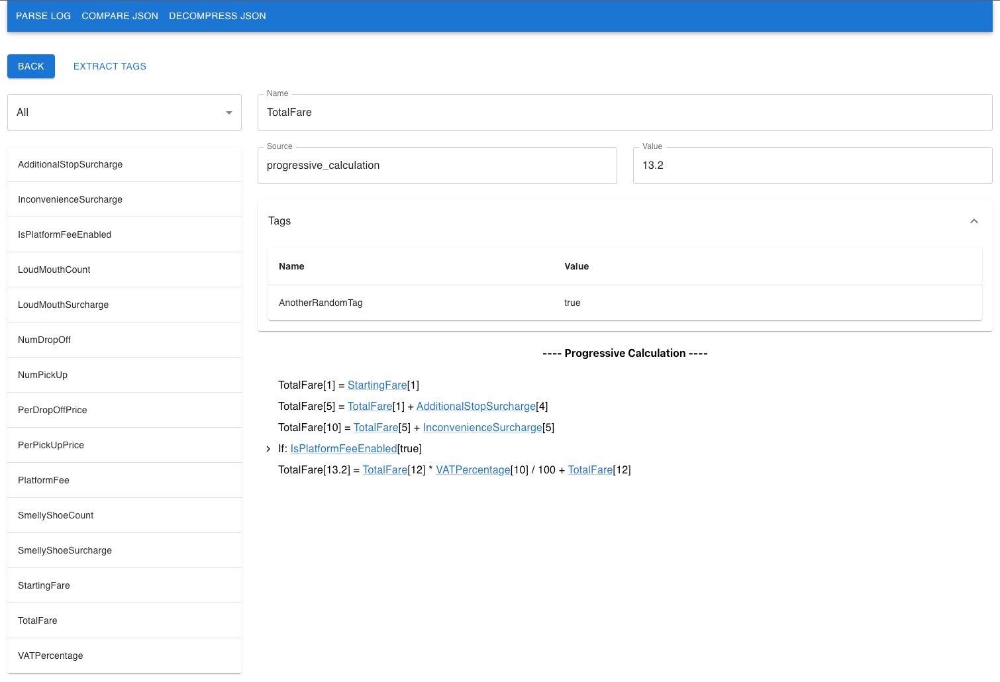

# Accountable Calculation Framework

Services that are responsible for performing calculations (e.g. product price) tend to be rule-based 
and carry many mathematical formulas. This framework provides an alternative/upgrade to the primitive 
data types (e.g. float64 & bool) such services normally employ to implement their calculation logic.

Behind the scene, when calculations are performed, the framework will silently collect all executed 
operations in the form of mathematical formulas that are human-readable. In addition, the framework 
will also capture the actual value of each operand in a formula at the time of execution. Other than 
that, engineers can also capture "why" certain calculations happened via `condition` and `boolean 
variable` features. 

Behind the scene, this framework utilizes the [decimal library](https://github.com/shopspring/decimal) 
to perform all mathematical operations. As a result, clients will never run into floating issues.

In the end, what we get is a single log message/object that represents the entire execution tree and 
also includes the mathematical formulas in human-readable format. Such log will be more coherent, 
unlike the fragmented nature of standard log messages where each message is recorded independently.

## Sample usage

For a demonstration, run the `sample.go` in the `main` package. You will get some JSON text in the 
console. After that, you can use this [GitHub page](https://jamestrandung.github.io/go-accountable-calculation-ui/) as 
a starting point to view the JSON output in a friendly UI. Depending on your needs, you can develop 
your own UI with more powerful features to serve your end users (e.g. let business users in your 
organization to debug issues on their own).

